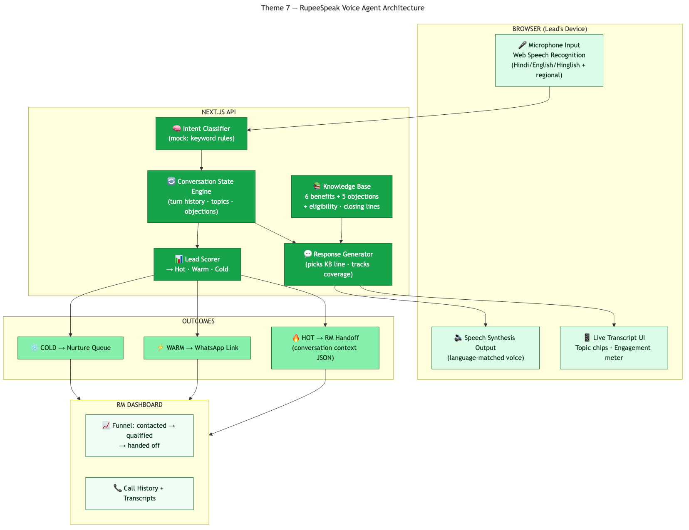

# RupeeSpeak — AI Voice Agent for Partner Lead Conversion

> **PanIIT AI for Bharat Hackathon** — Theme 7: Voice-Based AI for Social Impact

A browser-based AI voice agent that receives inbound partner leads, pitches Rupeezy's Authorized Person program in the lead's language (Hindi, English, Hinglish + regional), handles the 5 core objections conversationally, qualifies leads as Hot/Warm/Cold, and hands off to human RMs with full conversation context.

## Quick Start

```bash
# Install dependencies
npm install

# Set up database
npx prisma generate
npx prisma migrate dev --name init

# Seed demo data
npm run seed

# Start development server
npm run dev
```

Open [http://localhost:3000](http://localhost:3000) to see the dashboard.

## Demo Data

The seed script (`npm run seed`) populates:

- **14 Knowledge Base entries**: Opening lines, 6 benefits, 5 objections with rebuttals, eligibility criteria, 3 closing scripts (per language: English, Hindi, Hinglish)
- **10 Leads**: Mix of Hindi (4), English (3), Hinglish (2), Tamil (1)
- **6 Sample Calls**: 3 HOT, 2 WARM, 1 COLD — with full conversation transcripts showcasing:
  - Opening pitch
  - Objection handling (already with broker, not enough contacts, trust concerns)
  - Lead qualification
  - Handoff/WhatsApp follow-up

## Architecture



**Flow:**

1. **Browser** → Lead speaks via Web Speech API (mic input)
2. **Intent Classifier** → Mock AI detects intent (keyword matching: `already_with_broker`, `not_enough_contacts`, `trust_question`, etc.)
3. **Conversation State** → Tracks topics covered, objections raised, engagement score (0-1)
4. **Knowledge Base** → Pulls appropriate response in lead's language
5. **Response Generator** → Agent speaks via Speech Synthesis
6. **Lead Scorer** → At call end, computes HOT/WARM/COLD with reasoning
7. **Outcomes** → HOT → RM handoff with context JSON; WARM → WhatsApp follow-up; COLD → Nurture queue

## Tech Stack

- **Framework:** Next.js 15 (App Router), TypeScript
- **Database:** Prisma + SQLite (dev) / PostgreSQL (prod-ready)
- **Styling:** Tailwind CSS v3, shadcn/ui, Tremor charts
- **Voice:** Web Speech API (Recognition + Synthesis)
- **AI:** Mock conversation engine (keyword-based intent classification) — real LLM integration via `USE_MOCK_AI=false`
- **Icons:** lucide-react

## Pages

1. **Dashboard** (`/`) — Funnel metrics (Total → Contacted → Qualified → Handed Off), Hot/Warm/Cold breakdown, Recent calls feed
2. **Leads** (`/leads`) — Table of all leads with language, status, last call summary, "Call Now" action
3. **Voice Interface** (`/call/[leadId]`) — THE MONEY SHOT:
   - Left: Mic button, agent avatar, language selector, engagement meter
   - Right: Live transcript with intent badges, topics covered chips, objections handled chips
   - Real-time conversation with Web Speech API
4. **Call Detail** (`/calls/[id]`) — Post-call summary: interest verdict, reasoning, full transcript, handoff context (for HOT leads)
5. **Knowledge Base** (`/kb`) — Admin view of all conversation scripts by category (opening, benefit, objection, closing)

## API Routes

- `POST /api/calls/start` — Creates call, returns opening script
- `POST /api/calls/[id]/turn` — Adds turn (lead/agent), returns agent response
- `POST /api/calls/[id]/end` — Scores call, updates lead status
- `GET /api/calls/[id]` — Full call with turns
- `GET /api/leads` — List all leads with last call summary
- `POST /api/leads` — Create lead
- `POST /api/leads/bulk` — Bulk upload
- `GET /api/kb` — Knowledge base entries
- `GET /api/dashboard/funnel` — Dashboard metrics

## Mock AI Features

The mock conversation engine (`lib/ai.ts`) implements:

- **Intent Classification** (keyword matching):
  - `positive_acknowledgement`, `ready_to_sign_up`, `ask_for_details`
  - `already_with_broker`, `not_enough_contacts`, `trust_question`, `time_commitment`, `think_later`, `not_interested`
- **Response Selection** from Knowledge Base based on:
  - Current intent
  - Topics not yet covered
  - Objections raised
- **State Tracking**:
  - Topics covered (zero_joining_fee, brokerage_share, daily_payouts, rise_portal, support_training, eligibility_basic)
  - Objections raised (with rebuttals)
  - Lead engagement score (0-1, increases with positive signals, decreases with objections)
- **Closing Logic**:
  - HOT: engagement > 0.7 AND 3+ topics AND positive intent → RM handoff
  - WARM: moderate engagement OR "think later" → WhatsApp follow-up
  - COLD: low engagement OR explicit refusal → Log cold

## Lead Scoring Algorithm

```typescript
interestScore = 
  0.4 * leadEngagement +
  0.25 * (topicsCovered / 5) +
  0.15 * (turnCount / 12) +
  0.2 * (positiveIntents / 3) -
  0.05 * objectionsCount
```

**Thresholds:**

- HOT: score ≥ 0.75 AND 3+ topics AND positive intent
- COLD: score < 0.4 OR explicit disinterest
- WARM: everything else

**Reasoning includes:**

- Engagement percentage
- Topics discussed
- Objections raised and addressed
- Positive/negative signals from transcript

## Environment Variables

```bash
DATABASE_URL="file:./dev.db"
USE_MOCK_AI="true"
NEXT_PUBLIC_BASE_URL="http://localhost:3000"  # for SSR fetch
```

## Production Deployment

1. Swap SQLite for PostgreSQL: Update `prisma/schema.prisma` datasource
2. Enable real LLM: Set `USE_MOCK_AI=false` and implement `lib/ai.ts` real AI path (Gemini API, Claude API, etc.)
3. Add telephony: Integrate Twilio Voice API for inbound call handling
4. WhatsApp automation: Use Twilio/WhatsApp Business API for follow-up links
5. RM dashboard: Add CRM integration for handoff workflow

## Known Limitations (MVP)

- Web Speech API (browser-only) — production needs telephony (Twilio)
- Mock conversation engine — real LLM for nuanced understanding
- No call recording — needs server-side audio capture
- No multi-RM routing — single handoff queue
- Hindi/English/Hinglish only — Tamil/Telugu/Marathi/Gujarati/Bengali have limited KB

## Solution Document

See [docs/solution-document.md](docs/solution-document.md) for full problem statement, approach, technical details, and future roadmap.

## License

MIT
