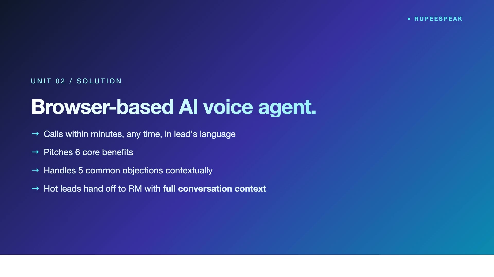

# RupeeSpeak — AI Voice Agent for Partner Lead Conversion

> **PanIIT AI for Bharat 2026 — Theme 7** · **Sponsor:** Rupeezy
> Speak · Qualify · Hand-off

[](https://github.com/sridhar7601/rupeezy-voice-agent/blob/main/demo/video/demo.mp4)

▶ **[Watch the 5-minute demo](https://github.com/sridhar7601/rupeezy-voice-agent/blob/main/demo/video/demo.mp4)**

---

## What it solves

Rupeezy partner RMs spend hours on cold leads — most never pick up, half of those who do raise the same five objections. **The first call is mostly objection handling and qualification, not selling.** Today RMs do that manually; cost per lead is high and conversion is opaque. RupeeSpeak handles the qualifying call so RMs only see warm leads.

## Key features

- **Browser-native voice** — Web Speech API for recognition + speech synthesis for response. Multilingual: Hindi / English / Kannada / Tamil / Telugu. Zero telephony cost in demo.
- **Stateful conversation engine** — Classifies intent per turn, tracks topics covered + objections raised, doesn't loop
- **KB-driven responses** — Every rebuttal + product fact in the knowledge base. Business teams update the KB; flow stays the same.
- **Top-5 Rupeezy objections** — *Already with another broker · brokerage too high · don't trust online · complex platform · prefer offline* — each with structured rebuttals
- **Hot/Warm/Cold qualification** — Engagement + interest signals → deterministic verdict; AI narrates reasoning
- **RM hand-off context** — Concrete, not generic — tells the RM exactly what was discussed and what to follow up on

## Architecture


> Source: [`docs/diagrams/architecture.mmd`](docs/diagrams/architecture.mmd) (Mermaid)

## Quick start

### Prerequisites

| Tool | Version |
|------|---------|
| Node.js | 18+ |
| npm | 9+ |

> No Python. No Docker. SQLite is bundled.

### Setup

```bash
# 1. Install
npm install

# 2. Configure environment (optional — without keys, AI falls back to deterministic templates)
cat > .env.local <<'EOF'
AZURE_OPENAI_API_KEY=your_key
AZURE_OPENAI_ENDPOINT=https://<resource>.openai.azure.com/openai/deployments/<deployment>/chat/completions?api-version=2025-01-01-preview
EOF

# 3. Set up the database
npx prisma generate
npx prisma migrate dev --name init

# 4. Seed demo data
npm run seed

# 5. Run the dev server
npm run dev
```

Open <http://localhost:3000>.

### One-liner

```bash
npm install && npx prisma generate && npx prisma migrate dev --name init && npm run seed && npm run dev
```


## Demo flow

1. `/leads` — multilingual seeded leads. Click **Call Now** on Rajesh Kumar.
2. `/call/<lead-id>` — agent opens the conversation. Speak: *"I'm already with another broker."* → intent OBJECTION → KB rebuttal
3. Continue the call until it ends
4. `/calls/<call-id>` — full transcript + intent badges + Hot/Warm/Cold verdict + RM hand-off context
5. `/kb` — every rebuttal and product fact (business teams edit this directly)

> **Demo data:** Multilingual seeded leads · KB covering Rupeezy's top 5 objections · sample calls demonstrating Hot / Warm / Cold outcomes

## Tech stack

| Layer | Technology |
|-------|------------|
| Framework | Next.js App Router + TypeScript |
| Database | Prisma + SQLite |
| Voice | Web Speech API (recognition + synthesis) |
| AI / LLM | Mock-first conversation engine in `lib/ai.ts` (Azure OpenAI GPT-4.1 with deterministic fallback) |
| Styling | Tailwind CSS + shadcn/ui + Tremor charts + lucide-react |

## Brief non-negotiables met

- ✅ KB-grounded responses (no hallucinated product facts)
- ✅ Multilingual by default
- ✅ Stateful conversation (no loops, tracks coverage)
- ✅ Deterministic verdict + narrated reasoning (engine decides, AI narrates)
- ✅ Zero install for partners taking the call

---

## Submission

- **Hackathon:** PanIIT AI for Bharat 2026
- **Theme:** 7 — AI Voice Agent for Partner Lead Conversion
- **Video:** https://github.com/sridhar7601/rupeezy-voice-agent/blob/main/demo/video/demo.mp4
- **Repo:** https://github.com/sridhar7601/rupeezy-voice-agent
- **Team:** Sridhar Suresh, Sruthi Krishnakumar
